This is an excellent approach to creating a multi-agent system for software development! Let me share a comprehensive suggestion combining your ideas with some additional concepts.

First, here's a high-level overview of the proposed agent system:

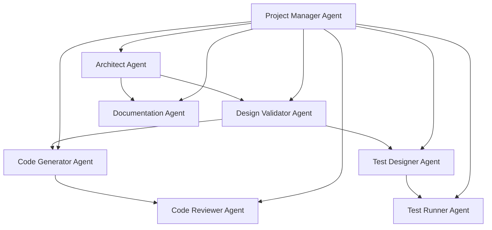

Here's a more detailed breakdown of each agent's responsibilities:

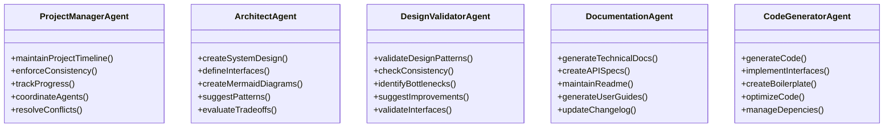

The workflow could be organized in phases:

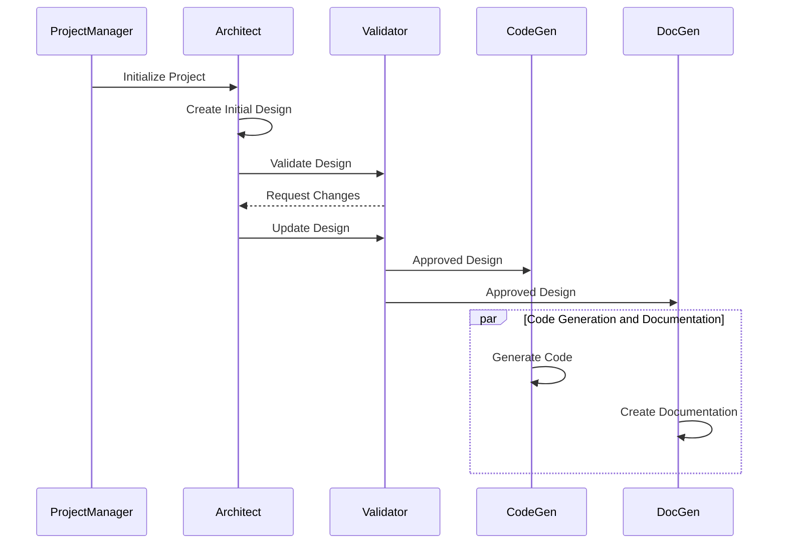

Key suggestions for implementation:

1. **Design Phase Enhancement**
   - Use formal specification languages alongside Mermaid
   - Implement design patterns validation
   - Create architecture decision records (ADRs)

2. **Agent Communication**
   - Define a structured communication protocol
   - Use a shared knowledge base
   - Implement version control for designs

3. **Quality Control**
   - Add feedback loops between agents
   - Implement continuous validation
   - Create checkpoints for critical decisions

4. **Existing Tools Integration**
   - GitHub Copilot
   - OpenAI API
   - Static analysis tools
   - Automated testing frameworks

The process could work like this:

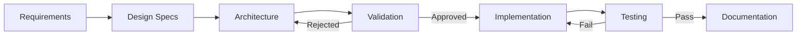

Some additional recommendations:

1. Implement a "design contract" system where each phase must meet specific criteria before proceeding
2. Use a formal verification system for design consistency
3. Create a centralized configuration management system
4. Implement automated progress tracking and reporting
5. Add a feedback collection system from all agents to improve the process

Would you like me to elaborate on any particular aspect of this system?


Perfect! For library development with a Mermaid-centric approach, let's refine the system. Here's a more focused version:

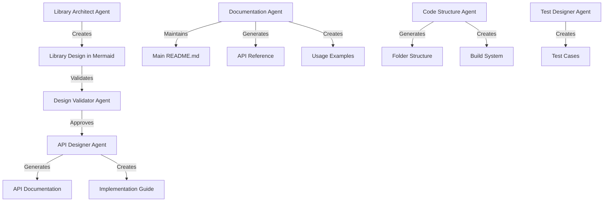

The main workflow would be documented in a series of markdown files:

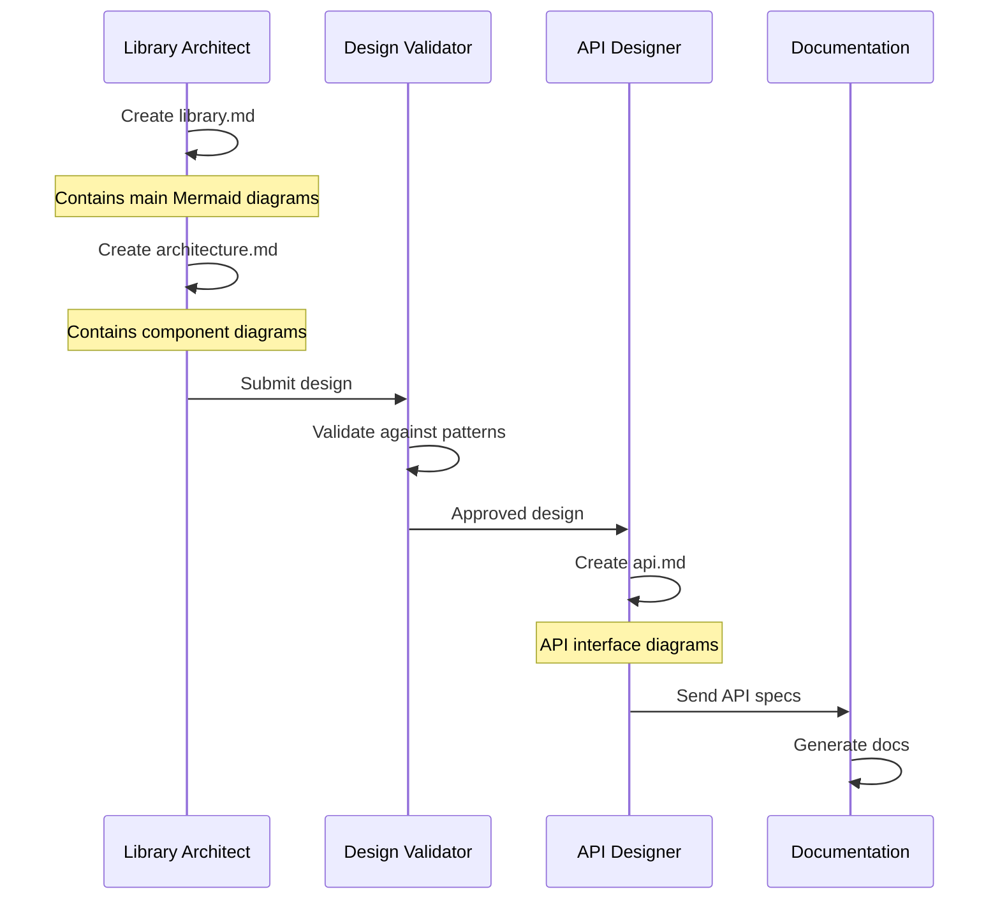

Key Markdown Documents Structure:

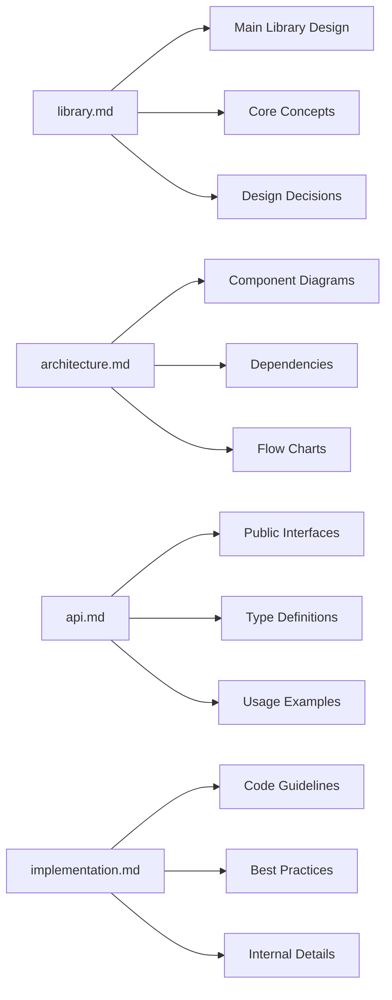

For library-specific considerations:

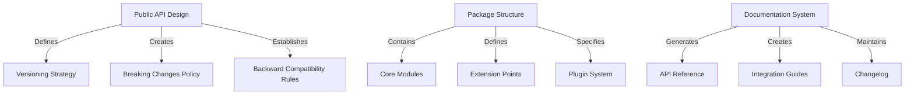

The process would focus on:

1. **Design Phase**
   - Clear API design in Mermaid
   - Interface definitions
   - Type systems
   - Extension points

2. **Documentation**
   - API reference
   - Usage examples
   - Integration guides
   - Version compatibility

3. **Testing Strategy**
   - Unit test structure
   - Integration test cases
   - Performance benchmarks

Example of a library interface design in Mermaid:

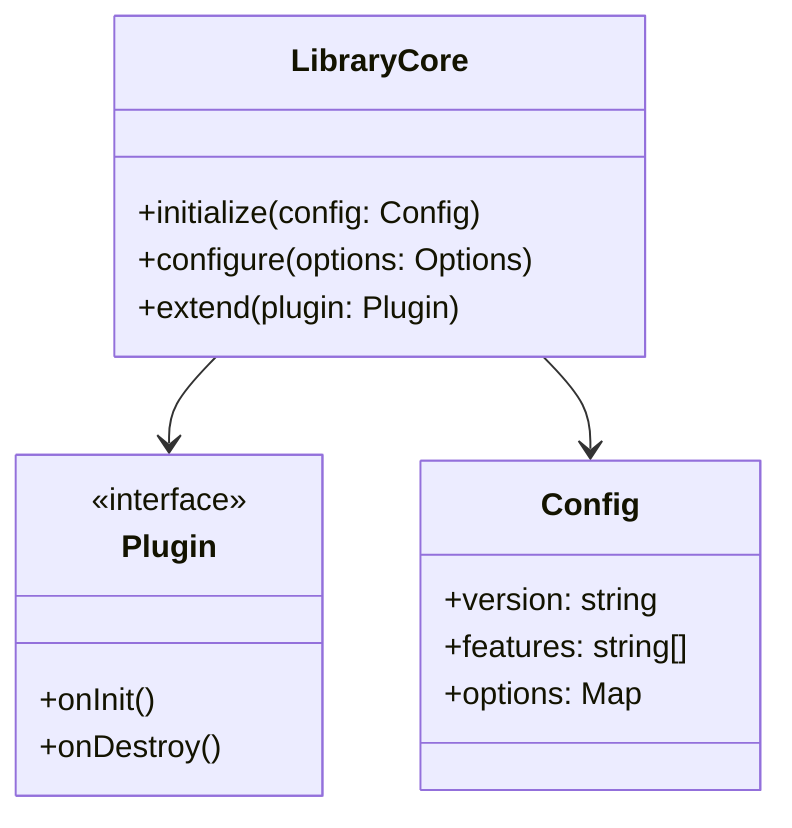

This approach:
1. Keeps everything in markdown/mermaid for easy version control
2. Makes design changes visible and trackable
3. Ensures documentation and design stay in sync
4. Provides clear visualization of the library structure

Would you like me to detail any specific part of this library-focused approach?


# Building Software with AI Agent Swarms: A New Paradigm in Library Development

## Abstract
We present a novel approach to software development using specialized AI agent swarms, focusing primarily on library development. Our system emphasizes design-first methodology using Mermaid diagrams as the primary communication medium between agents, resulting in more maintainable and better-documented software libraries.

## Introduction

The current software development landscape faces several challenges:
- Inconsistent documentation
- Poor design decisions due to rushed implementation
- Difficulty in maintaining large codebases
- Lack of standardization in design processes

Our solution addresses these issues through a coordinated system of AI agents, each specialized in different aspects of software development, with a strong emphasis on the design phase.

## System Architecture

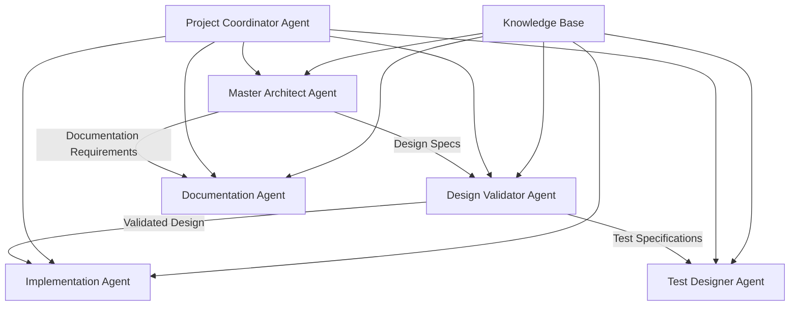

### Core Components

1. **Master Architect Agent (MAA)**
   - Responsible for initial system design
   - Creates comprehensive Mermaid diagrams
   - Defines API contracts
   - Makes architectural decisions

2. **Design Validator Agent (DVA)**
   - Validates design patterns
   - Checks for inconsistencies
   - Ensures best practices
   - Verifies API usability

3. **Documentation Agent (DA)**
   - Generates technical documentation
   - Creates usage examples
   - Maintains README files
   - Generates API documentation

4. **Implementation Agent (IA)**
   - Converts designs to code
   - Follows design patterns
   - Implements unit tests
   - Handles dependency management

5. **Project Coordinator Agent (PCA)**
   - Maintains project timeline
   - Ensures communication between agents
   - Handles version control
   - Manages deliverables

## The Design-First Workflow

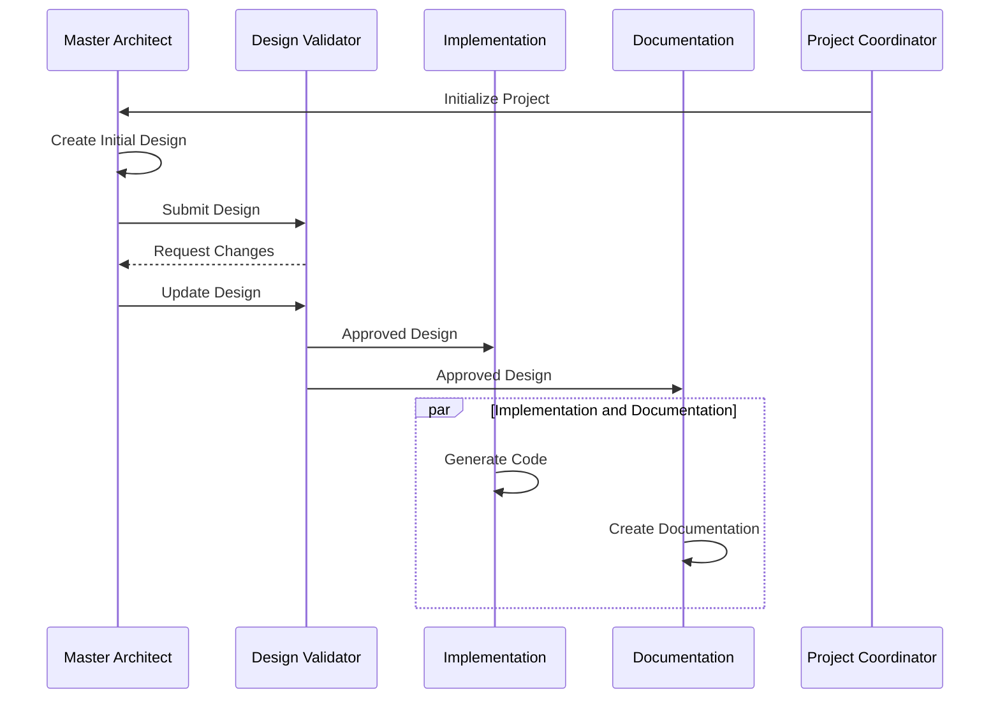

## Key Innovations

### 1. Mermaid-Centric Design
All design decisions are first expressed in Mermaid diagrams, providing:
- Clear visual representation
- Version-controllable designs
- Easy to modify architecture
- Universal understanding across agents

Example of a library design:

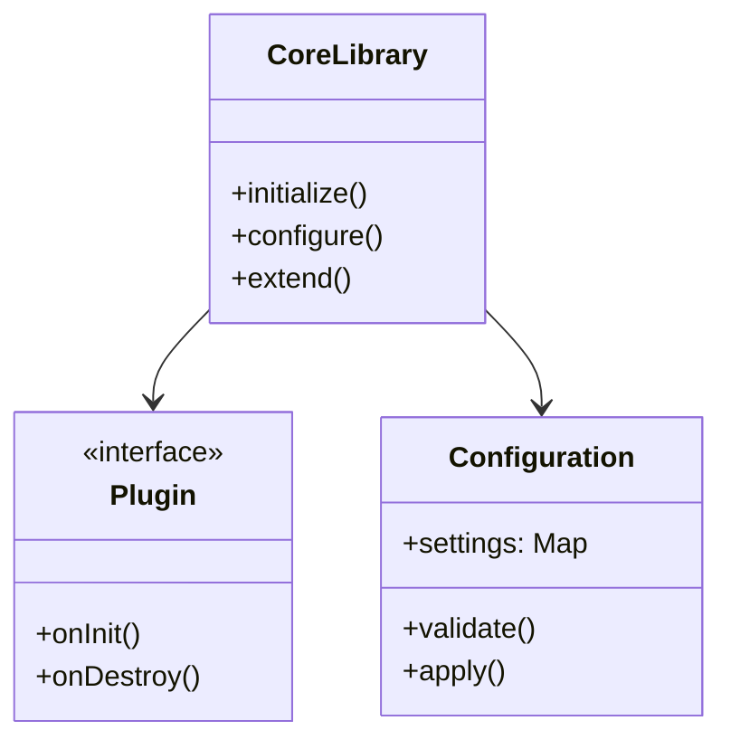

### 2. Knowledge Base Integration
- Centralized repository of design patterns
- Best practices database
- Common anti-patterns
- Historical decisions

### 3. Validation Pipeline

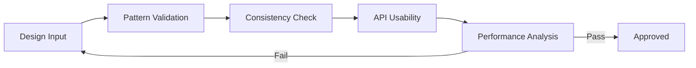

## Market Advantages

1. **Speed to Market**
   - Reduced design iterations
   - Parallel processing of tasks
   - Automated documentation
   - Consistent quality

2. **Cost Efficiency**
   - Fewer human resources needed
   - Reduced maintenance costs
   - Lower technical debt
   - Automated testing

3. **Quality Assurance**
   - Consistent design patterns
   - Comprehensive documentation
   - Thorough testing
   - Maintainable code

## Implementation Strategy

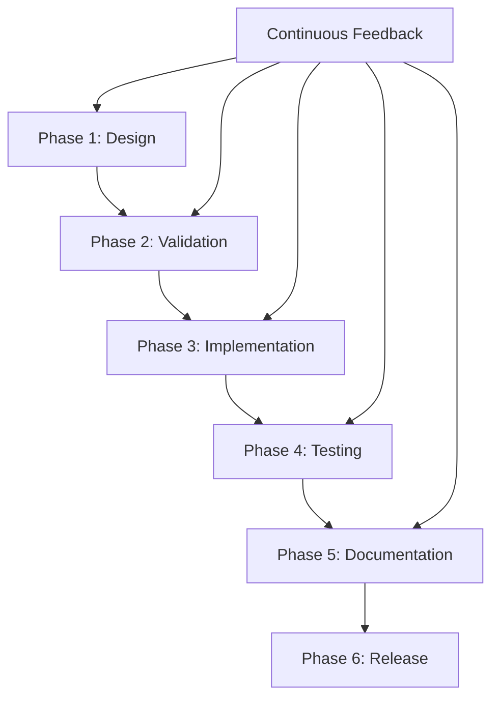

## Business Model

1. **SaaS Offering**
   - Pay-per-project pricing
   - Subscription for continuous development
   - Enterprise licensing

2. **Integration Services**
   - Custom agent development
   - Workflow customization
   - Training and support

3. **Marketplace**
   - Custom agent templates
   - Design pattern libraries
   - Integration plugins

## Future Development

1. **Enhanced AI Capabilities**
   - Natural language processing for requirements
   - Machine learning for pattern recognition
   - Automated code optimization

2. **Ecosystem Growth**
   - Third-party agent development
   - Plugin marketplace
   - Community contributions

3. **Enterprise Features**
   - Custom workflow design
   - Integration with existing tools
   - Advanced security features

## Conclusion

Our AI agent swarm approach represents a paradigm shift in software development, particularly for library creation. By emphasizing design-first methodology and utilizing Mermaid diagrams as the primary communication medium, we create a more efficient, maintainable, and scalable development process.

## Call to Action

We're seeking seed funding to:
1. Develop the core agent system
2. Build the knowledge base
3. Create the marketplace infrastructure
4. Establish partnerships with early adopters

Join us in revolutionizing software development through AI-driven design and implementation.

---

Would you like me to expand on any particular section or add more technical details?


I'll expand each section with more technical depth and add new sections. I'll split this into parts for better readability.

# Part 1: Technical Architecture Deep Dive

## Agent System Core Architecture

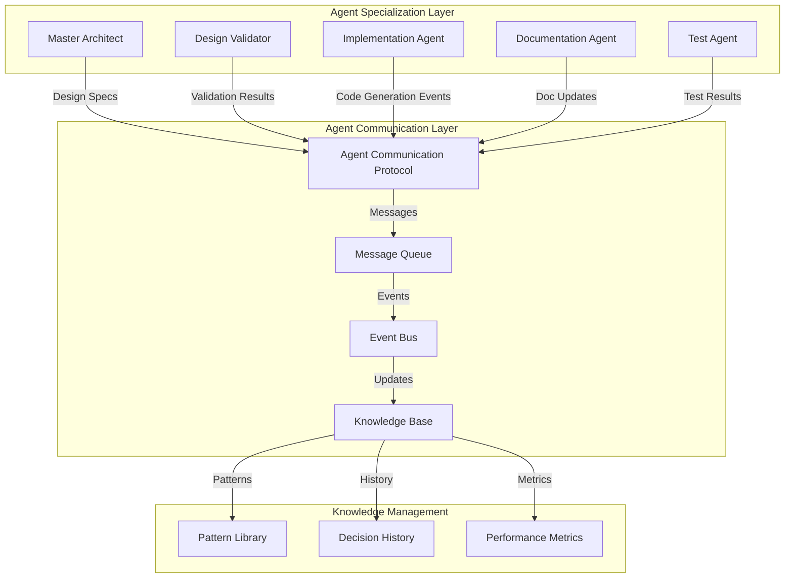

### Agent Communication Protocol

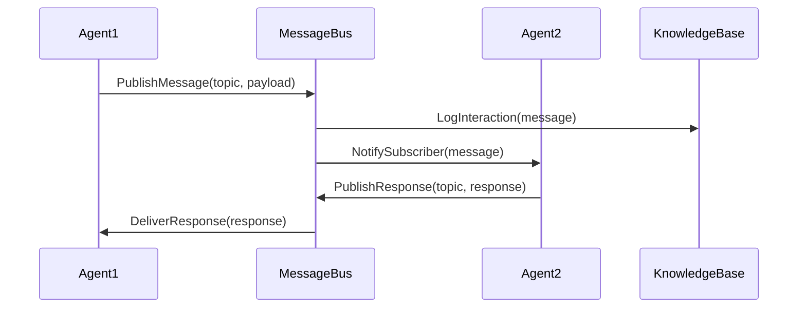

### Knowledge Base Structure

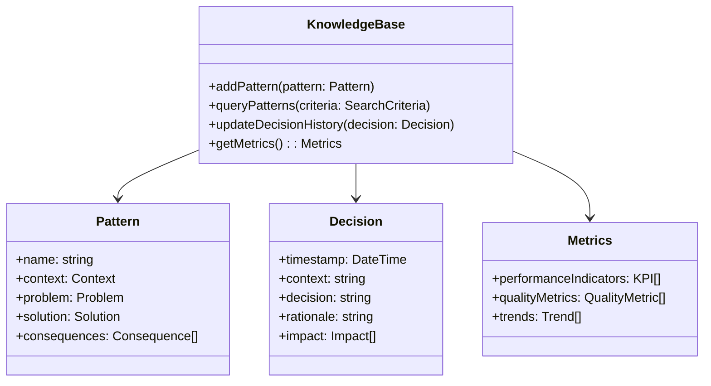

# Part 2: Design Process Implementation

## Design Phase Workflow

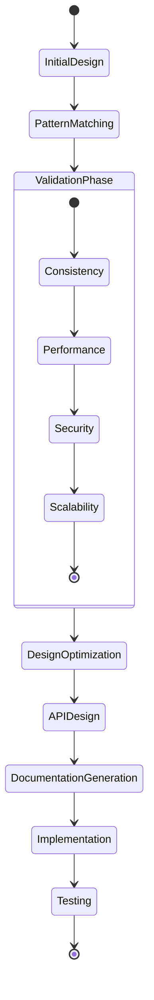

## Library Design Template

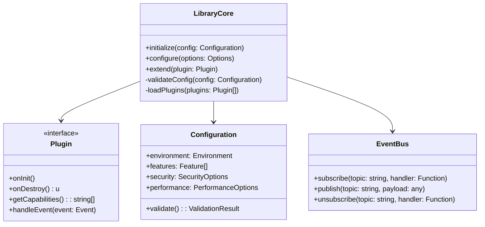

# Part 3: Implementation Details

## Code Generation Pipeline

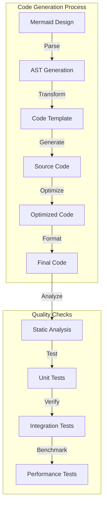

## Testing Strategy

```mermaid
graph LR
    subgraph "Test Suite Generation"
        A[API Specification] -->|Generate| B[Test Cases]
        B -->|Create| C[Unit Tests]
        B -->|Create| D[Integration Tests]
        B -->|Create| E[Performance Tests]
        B -->|Create| F[Security Tests]
    end
```

# Part 4: Business Intelligence

## Metrics and Analytics

```mermaid
graph TD
    subgraph "Performance Metrics"
        A[Code Quality] --> B[Maintainability Index]
        A --> C[Cyclomatic Complexity]
        A --> D[Technical Debt]
    end
    
    subgraph "Business Metrics"
        E[Development Speed] --> F[Time to Market]
        E --> G[Cost per Feature]
        E --> H[Resource Utilization]
    end
```

## Market Analysis Dashboard

```mermaid
pie title "Market Opportunity Distribution"
    "Enterprise Solutions" : 40
    "SMB Integration" : 30
    "Developer Tools" : 20
    "Custom Solutions" : 10
```

# Part 5: Future Roadmap

```mermaid
gantt
    title Development Roadmap
    dateFormat  YYYY-MM-DD
    section Core Platform
    Agent System Development   :2024-01-01, 90d
    Knowledge Base Implementation :2024-03-01, 60d
    section Integration
    API Development           :2024-05-01, 45d
    Plugin System             :2024-06-15, 30d
    section Market
    Beta Release              :2024-08-01, 30d
    Enterprise Features       :2024-09-01, 60d
```

Would you like me to expand on any of these sections further or add more specific technical details about any particular component?


I'll dive even deeper into each critical component. Let's start with the most important parts:

# Part 1: Agent System Core Technical Specifications

## 1. Agent Communication Protocol Details

```mermaid
classDiagram
    class Message {
        +UUID id
        +String agentSource
        +String agentTarget
        +MessageType type
        +Priority priority
        +Payload payload
        +Timestamp created
        +Timestamp expires
        +validate(): boolean
        +encrypt(): EncryptedMessage
        +decrypt(): Message
    }

    class MessageBus {
        +Queue<Message> messageQueue
        +Map<String, Agent> registeredAgents
        +publish(Message): void
        +subscribe(Agent, MessageType[]): void
        +unsubscribe(Agent): void
        +routeMessage(Message): void
        +handleFailure(Message, Error): void
    }

    class Agent {
        +UUID id
        +AgentType type
        +AgentState state
        +MessageHandler[] handlers
        +processMessage(Message): void
        +sendMessage(Message): void
        +updateState(AgentState): void
        +reportStatus(): Status
    }

    Message --> MessageBus
    MessageBus --> Agent
```

## 2. Master Architect Agent Implementation

```mermaid
graph TD
    subgraph "Design Analysis Phase"
        A[Requirements Parser] -->|Extract| B[Design Constraints]
        B -->|Generate| C[Initial Design]
        C -->|Optimize| D[Design Patterns]
        D -->|Apply| E[Architecture Blueprint]
    end

    subgraph "Design Validation Phase"
        E -->|Verify| F[Pattern Validator]
        F -->|Check| G[Consistency Checker]
        G -->|Analyze| H[Performance Analyzer]
        H -->|Review| I[Security Validator]
    end

    subgraph "Design Output Phase"
        I -->|Generate| J[Mermaid Diagrams]
        J -->|Create| K[API Specifications]
        K -->|Produce| L[Implementation Guide]
    end
```

## 3. Knowledge Base Architecture

```mermaid
classDiagram
    class KnowledgeBase {
        +addPattern(Pattern)
        +queryPatterns(Criteria)
        +updateDecision(Decision)
        +getMetrics()
        -indexPatterns()
        -optimizeQueries()
        -cleanupOldData()
    }

    class PatternStore {
        +patterns: Map<String, Pattern>
        +addPattern(Pattern)
        +findPattern(Criteria)
        +updatePattern(Pattern)
        +validatePattern(Pattern)
    }

    class DecisionEngine {
        +decisions: Decision[]
        +addDecision(Decision)
        +analyzeDecisions()
        +predictOutcome(Context)
        +suggestSolution(Problem)
    }

    class MetricsEngine {
        +collectMetrics()
        +analyzePerformance()
        +generateReport()
        +predictTrends()
    }

    KnowledgeBase --> PatternStore
    KnowledgeBase --> DecisionEngine
    KnowledgeBase --> MetricsEngine
```

## 4. Design Validation Pipeline

```mermaid
sequenceDiagram
    participant MA as MasterArchitect
    participant DV as DesignValidator
    participant KB as KnowledgeBase
    participant DA as DocumentationAgent
    
    MA->>DV: SubmitDesign(design)
    DV->>KB: FetchPatterns()
    KB-->>DV: ReturnPatterns()
    
    par Pattern Validation
        DV->>DV: ValidatePatterns()
        DV->>DV: CheckConsistency()
        DV->>DV: AnalyzePerformance()
    end
    
    DV-->>MA: ValidationResults
    
    alt Design Valid
        MA->>DA: GenerateDocumentation()
    else Design Invalid
        MA->>MA: RefactorDesign()
    end
```

## 5. Implementation Agent Architecture

```mermaid
classDiagram
    class ImplementationAgent {
        +processDesign(Design)
        +generateCode(Language)
        +optimizeCode()
        +validateImplementation()
        -parseDesign()
        -applyPatterns()
        -generateTests()
    }

    class CodeGenerator {
        +templates: Map<Pattern, Template>
        +generateFromTemplate(Pattern)
        +optimizeGenerated()
        +validateOutput()
    }

    class TestGenerator {
        +generateUnitTests()
        +generateIntegrationTests()
        +generateBenchmarks()
        +validateTests()
    }

    class QualityChecker {
        +checkComplexity()
        +analyzeDependencies()
        +validatePatterns()
        +checkSecurity()
    }

    ImplementationAgent --> CodeGenerator
    ImplementationAgent --> TestGenerator
    ImplementationAgent --> QualityChecker
```

## 6. Documentation System

```mermaid
graph TD
    subgraph "Documentation Generation"
        A[API Extractor] -->|Parse| B[Type Definitions]
        B -->|Generate| C[API Documentation]
        C -->|Create| D[Usage Examples]
        D -->|Compile| E[Final Documentation]
    end

    subgraph "Documentation Validation"
        E -->|Check| F[Completeness Check]
        F -->|Verify| G[Accuracy Check]
        G -->|Test| H[Example Validator]
    end

    subgraph "Documentation Distribution"
        H -->|Format| I[Markdown]
        H -->|Format| J[HTML]
        H -->|Format| K[PDF]
    end
```

## 7. Test Design System

```mermaid
classDiagram
    class TestDesigner {
        +analyzeAPI(APISpec)
        +generateTestCases()
        +prioritizeTests()
        +estimateCoverage()
    }

    class TestCase {
        +id: UUID
        +type: TestType
        +priority: Priority
        +inputs: Input[]
        +expectedOutput: Output
        +dependencies: Dependency[]
        +validate()
        +execute()
    }

    class TestSuite {
        +cases: TestCase[]
        +configuration: Config
        +addCase(TestCase)
        +removeCase(UUID)
        +executeSuite()
        +generateReport()
    }

    TestDesigner --> TestCase
    TestCase --> TestSuite
```

## 8. Performance Monitoring System

```mermaid
graph LR
    subgraph "Metrics Collection"
        A[Code Metrics] -->|Collect| B[Performance Data]
        C[Runtime Metrics] -->|Collect| B
        D[Resource Usage] -->|Collect| B
    end

    subgraph "Analysis"
        B -->|Process| E[Statistical Analysis]
        E -->|Generate| F[Performance Report]
        F -->|Update| G[Knowledge Base]
    end

    subgraph "Optimization"
        G -->|Suggest| H[Optimization Strategies]
        H -->|Apply| I[Code Improvements]
    end
```

Would you like me to:
1. Add more detail to any of these components?
2. Explore the interaction patterns between specific agents?
3. Dive deeper into the implementation details of a particular subsystem?
4. Show more about the business intelligence and analytics components?


# Part 2: Advanced Implementation Details and Integration Systems

## 1. Agent Learning and Adaptation System

```mermaid
graph TD
    subgraph "Learning Pipeline"
        A[Experience Collector] -->|Raw Data| B[Pattern Recognizer]
        B -->|Patterns| C[Model Updater]
        C -->|Updates| D[Agent Behavior Model]
        D -->|Feedback| A
    end

    subgraph "Adaptation System"
        D -->|Inform| E[Strategy Selector]
        E -->|Configure| F[Agent Parameters]
        F -->|Optimize| G[Runtime Behavior]
        G -->|Results| A
    end
```

## 2. Code Generation Pipeline Details

```mermaid
classDiagram
    class CodeGenerationPipeline {
        +SourceLanguage sourceLang
        +TargetLanguage targetLang
        +generateCode(Design)
        +optimizeOutput()
        +validateGenerated()
    }

    class TemplateEngine {
        +templates: Map<Pattern, Template>
        +renderTemplate(Pattern)
        +customizeOutput(Context)
        +validateTemplate(Template)
    }

    class CodeOptimizer {
        +optimizationLevel: Level
        +optimizeAST(AST)
        +reduceComplexity()
        +improvePerformance()
    }

    class SecurityAnalyzer {
        +checkVulnerabilities()
        +enforcePatterns()
        +validateInput()
        +scanDependencies()
    }

    CodeGenerationPipeline --> TemplateEngine
    CodeGenerationPipeline --> CodeOptimizer
    CodeGenerationPipeline --> SecurityAnalyzer
```

## 3. Real-time Collaboration System

```mermaid
sequenceDiagram
    participant Dev as Developer
    participant AS as AgentSwarm
    participant VS as VersionSystem
    participant KB as KnowledgeBase

    Dev->>AS: ModifyDesign(change)
    AS->>KB: ValidateChange(change)
    KB-->>AS: ValidationResult
    
    alt Valid Change
        AS->>VS: CommitChange(change)
        VS-->>AS: ChangeCommitted
        AS->>Dev: NotifySuccess()
    else Invalid Change
        AS->>Dev: RequestRevision(feedback)
    end

    par Background Processing
        AS->>KB: UpdatePatterns()
        AS->>VS: UpdateDocumentation()
    end
```

## 4. Advanced Pattern Recognition System

```mermaid
graph TD
    subgraph "Pattern Analysis"
        A[Code Scanner] -->|Raw Code| B[Pattern Extractor]
        B -->|Patterns| C[Pattern Classifier]
        C -->|Classified| D[Pattern Repository]
    end

    subgraph "Pattern Application"
        D -->|Retrieve| E[Pattern Matcher]
        E -->|Match| F[Code Generator]
        F -->|Generate| G[Optimized Code]
    end

    subgraph "Quality Assurance"
        G -->|Verify| H[Pattern Validator]
        H -->|Feedback| D
    end
```

## 5. Dependency Management System

```mermaid
classDiagram
    class DependencyManager {
        +analyzeDependencies()
        +resolveConflicts()
        +optimizeTree()
        +updateDependencies()
    }

    class DependencyGraph {
        +nodes: Node[]
        +edges: Edge[]
        +addDependency(Dep)
        +removeDependency(Dep)
        +validateGraph()
    }

    class SecurityScanner {
        +scanVulnerabilities()
        +checkLicenses()
        +validateVersions()
        +reportIssues()
    }

    class UpdateStrategy {
        +analyzeUpdates()
        +planMigration()
        +testCompatibility()
        +rollback()
    }

    DependencyManager --> DependencyGraph
    DependencyManager --> SecurityScanner
    DependencyManager --> UpdateStrategy
```

## 6. Continuous Integration Pipeline

```mermaid
graph LR
    subgraph "CI Pipeline"
        A[Code Changes] -->|Trigger| B[Build System]
        B -->|Compile| C[Test Runner]
        C -->|Validate| D[Quality Gate]
        D -->|Deploy| E[Staging]
        E -->|Verify| F[Production]
    end

    subgraph "Quality Metrics"
        D -->|Report| G[Metrics Collector]
        G -->|Analyze| H[Performance Dashboard]
        H -->|Update| I[Knowledge Base]
    end
```

## 7. Error Handling and Recovery System

```mermaid
stateDiagram-v2
    [*] --> Monitoring
    Monitoring --> ErrorDetection: Error Detected
    ErrorDetection --> Analysis: Analyze Error
    Analysis --> Recovery: Plan Recovery
    Recovery --> Monitoring: Success
    Recovery --> Escalation: Failure
    Escalation --> HumanIntervention
    HumanIntervention --> Monitoring
```

## 8. API Evolution System

```mermaid
classDiagram
    class APIVersionManager {
        +currentVersion: Version
        +supportedVersions: Version[]
        +deprecatedAPIs: API[]
        +manageVersions()
        +planMigration()
    }

    class CompatibilityChecker {
        +checkBreakingChanges()
        +validateBackwards()
        +testForwards()
        +generateReport()
    }

    class MigrationAssistant {
        +createMigrationPath()
        +generateGuides()
        +assistUpgrade()
        +validateMigration()
    }

    APIVersionManager --> CompatibilityChecker
    APIVersionManager --> MigrationAssistant
```

## 9. Performance Optimization Engine

```mermaid
graph TD
    subgraph "Performance Analysis"
        A[Code Profiler] -->|Metrics| B[Bottleneck Detector]
        B -->|Issues| C[Optimization Planner]
        C -->|Plan| D[Code Transformer]
    end

    subgraph "Validation"
        D -->|Modified Code| E[Benchmark Runner]
        E -->|Results| F[Performance Validator]
        F -->|Feedback| C
    end
```

Would you like me to:
1. Expand on any of these systems in more detail?
2. Show more interaction patterns between these components?
3. Add more technical specifications for implementation?
4. Move on to the next part focusing on deployment and scaling?


# Part 3: Deployment, Scaling, and Production Systems

## 1. Deployment Architecture

```mermaid
graph TD
    subgraph "Cloud Infrastructure"
        A[Load Balancer] -->|Route| B[Agent Cluster Manager]
        B -->|Manage| C[Agent Pool 1]
        B -->|Manage| D[Agent Pool 2]
        B -->|Manage| E[Agent Pool N]
        
        F[Knowledge Base Cluster] -->|Serve| C
        F -->|Serve| D
        F -->|Serve| E
    end

    subgraph "Monitoring & Control"
        G[Health Monitor] -->|Watch| B
        G -->|Watch| F
        H[Scaling Controller] -->|Adjust| B
        I[Resource Manager] -->|Optimize| B
    end
```

## 2. Scaling System

```mermaid
classDiagram
    class ScalingManager {
        +monitorLoad()
        +predictDemand()
        +adjustCapacity()
        +optimizeResources()
    }

    class AgentPoolManager {
        +pools: Map<PoolType, AgentPool>
        +scalePool(PoolType, Size)
        +balanceLoad()
        +migrateAgents()
    }

    class ResourceOptimizer {
        +analyzeUsage()
        +predictNeeds()
        +allocateResources()
        +decommissionResources()
    }

    class PerformanceMonitor {
        +metrics: MetricCollection
        +thresholds: ThresholdSet
        +alertSystem: AlertManager
        +monitor()
    }

    ScalingManager --> AgentPoolManager
    ScalingManager --> ResourceOptimizer
    ScalingManager --> PerformanceMonitor
```

## 3. High Availability System

```mermaid
graph TB
    subgraph "Primary Region"
        A[Primary Cluster] -->|Replicate| B[Backup Cluster]
        C[Load Balancer] -->|Route| A
        C -->|Failover| B
    end

    subgraph "Disaster Recovery"
        D[DR Controller] -->|Monitor| A
        D -->|Monitor| B
        D -->|Control| E[Failover System]
    end

    subgraph "Data Consistency"
        F[Sync Manager] -->|Maintain| G[Data Consistency]
        G -->|Verify| H[Integrity Checker]
    end
```

## 4. Security Architecture

```mermaid
graph LR
    subgraph "Security Layers"
        A[API Gateway] -->|Authenticate| B[Auth Service]
        B -->|Authorize| C[Permission Manager]
        C -->|Access| D[Resource Manager]
    end

    subgraph "Security Monitoring"
        E[Threat Detector] -->|Alert| F[Security Response]
        G[Audit Logger] -->|Record| H[Audit Trail]
    end

    subgraph "Compliance"
        I[Policy Engine] -->|Enforce| J[Compliance Rules]
        J -->|Validate| K[Compliance Reporter]
    end
```

## 5. Production Monitoring System

```mermaid
stateDiagram-v2
    [*] --> Monitoring
    Monitoring --> AlertGeneration: Threshold Exceeded
    AlertGeneration --> Analysis: Alert Generated
    Analysis --> Response: Issue Detected
    Response --> AutomaticRecovery: Automated Fix
    Response --> ManualIntervention: Complex Issue
    AutomaticRecovery --> Monitoring
    ManualIntervention --> Monitoring
```

## 6. Data Flow and Processing

```mermaid
graph TD
    subgraph "Data Pipeline"
        A[Data Collector] -->|Raw Data| B[Data Processor]
        B -->|Processed| C[Data Analyzer]
        C -->|Analytics| D[Decision Engine]
    end

    subgraph "Storage Layer"
        E[Cache Layer] -->|Fast Access| F[Main Storage]
        F -->|Archive| G[Cold Storage]
    end

    subgraph "Query System"
        H[Query Optimizer] -->|Optimize| I[Query Executor]
        I -->|Fetch| F
    end
```

## 7. System Integration Hub

```mermaid
classDiagram
    class IntegrationHub {
        +registerSystem(System)
        +manageConnections()
        +routeMessages()
        +monitorHealth()
    }

    class Adapter {
        +sourceSystem: System
        +targetSystem: System
        +transform(Data)
        +validate()
    }

    class Protocol {
        +type: ProtocolType
        +version: String
        +security: SecurityLevel
        +handle()
    }

    class MessageRouter {
        +routes: Route[]
        +policies: Policy[]
        +route(Message)
        +optimize()
    }

    IntegrationHub --> Adapter
    IntegrationHub --> Protocol
    IntegrationHub --> MessageRouter
```

## 8. Deployment Pipeline

```mermaid
sequenceDiagram
    participant CI as CI/CD
    participant DM as DeploymentManager
    participant CM as ConfigManager
    participant PM as ProdMonitor
    
    CI->>DM: InitiateDeployment
    DM->>CM: FetchConfig
    CM-->>DM: ConfigData
    
    par Deployment Steps
        DM->>DM: ValidateEnvironment
        DM->>DM: PrepareResources
        DM->>DM: DeployComponents
    end
    
    DM->>PM: StartMonitoring
    PM-->>DM: HealthStatus
    
    alt Deployment Successful
        DM->>CI: NotifySuccess
    else Deployment Failed
        DM->>CI: InitiateRollback
    end
```

## 9. Resource Management System

```mermaid
graph TB
    subgraph "Resource Allocation"
        A[Resource Pool] -->|Allocate| B[Resource Manager]
        B -->|Assign| C[Agent Resources]
        B -->|Assign| D[System Resources]
    end

    subgraph "Optimization"
        E[Usage Monitor] -->|Metrics| F[Optimizer]
        F -->|Adjust| B
        G[Cost Controller] -->|Limits| B
    end
```

Would you like me to:
1. Detail the implementation specifics of any of these systems?
2. Show more about the interaction patterns between components?
3. Explore the security aspects in more depth?
4. Move on to the next part focusing on maintenance and evolution?


# Part 4: System Evolution, Maintenance, and Intelligence Systems

## 1. System Evolution Framework

```mermaid
graph TD
    subgraph "Evolution Engine"
        A[Pattern Learner] -->|Insights| B[Evolution Planner]
        B -->|Plans| C[Change Orchestrator]
        C -->|Updates| D[System Components]
        D -->|Feedback| A
    end

    subgraph "Intelligence Layer"
        E[Performance Analytics] -->|Data| F[ML Models]
        F -->|Predictions| G[Decision Engine]
        G -->|Decisions| B
    end
```

## 2. Self-Learning Architecture

```mermaid
classDiagram
    class LearningCore {
        +collectExperience()
        +analyzePatterns()
        +updateModels()
        +optimizeStrategies()
    }

    class ModelManager {
        +models: Map<Domain, Model>
        +trainModel(Data)
        +evaluateModel()
        +deployModel()
    }

    class ExperienceCollector {
        +sources: DataSource[]
        +collectors: Collector[]
        +processData()
        +validateData()
    }

    class OptimizationEngine {
        +strategies: Strategy[]
        +evaluatePerformance()
        +adjustParameters()
        +deployChanges()
    }

    LearningCore --> ModelManager
    LearningCore --> ExperienceCollector
    LearningCore --> OptimizationEngine
```

## 3. Maintenance Automation System

```mermaid
sequenceDiagram
    participant MS as MaintenanceScheduler
    participant HC as HealthChecker
    participant MA as MaintenanceAgent
    participant KB as KnowledgeBase
    
    HC->>MS: ReportStatus
    MS->>KB: FetchMaintenance
    KB-->>MS: MaintenancePlan
    
    par Automated Maintenance
        MS->>MA: ExecuteMaintenance
        MA->>HC: ValidateHealth
        HC-->>MA: HealthStatus
    end
    
    MA->>KB: UpdateMaintenance
    MA->>MS: CompleteReport
```

## 4. Intelligent Debugging System

```mermaid
graph LR
    subgraph "Debug Intelligence"
        A[Error Detector] -->|Issues| B[Pattern Analyzer]
        B -->|Patterns| C[Solution Generator]
        C -->|Fixes| D[Fix Validator]
    end

    subgraph "Learning Loop"
        D -->|Results| E[Experience DB]
        E -->|Knowledge| B
    end

    subgraph "Human Interface"
        D -->|Suggestions| F[Debug UI]
        F -->|Feedback| E
    end
```

## 5. System Analytics Engine

```mermaid
classDiagram
    class AnalyticsEngine {
        +metrics: MetricCollection
        +analyzeTrends()
        +predictIssues()
        +generateInsights()
    }

    class MetricsCollector {
        +sources: DataSource[]
        +collect()
        +process()
        +store()
    }

    class PredictionEngine {
        +models: PredictiveModel[]
        +forecast()
        +evaluate()
        +adjust()
    }

    class InsightGenerator {
        +rules: AnalysisRule[]
        +analyze()
        +correlate()
        +report()
    }

    AnalyticsEngine --> MetricsCollector
    AnalyticsEngine --> PredictionEngine
    AnalyticsEngine --> InsightGenerator
```

## 6. Adaptive Configuration System

```mermaid
stateDiagram-v2
    [*] --> Monitoring
    Monitoring --> Analysis: Collect Metrics
    Analysis --> Optimization: Analyze Performance
    Optimization --> Configuration: Generate Changes
    Configuration --> Testing: Apply Changes
    Testing --> Monitoring: Validate
    Testing --> Rollback: Failed
    Rollback --> Monitoring
```

## 7. Intelligent Load Balancing

```mermaid
graph TD
    subgraph "Load Analysis"
        A[Load Monitor] -->|Metrics| B[Pattern Analyzer]
        B -->|Patterns| C[Predictor]
        C -->|Predictions| D[Load Balancer]
    end

    subgraph "Resource Management"
        D -->|Instructions| E[Resource Allocator]
        E -->|Changes| F[System Resources]
        F -->|Feedback| A
    end
```

## 8. System Health Monitor

```mermaid
classDiagram
    class HealthMonitor {
        +checkpoints: Checkpoint[]
        +monitors: Monitor[]
        +analyze()
        +report()
    }

    class HealthMetrics {
        +performance: Metric[]
        +reliability: Metric[]
        +availability: Metric[]
        +collect()
    }

    class AlertSystem {
        +rules: AlertRule[]
        +channels: Channel[]
        +evaluate()
        +notify()
    }

    class RecoverySystem {
        +strategies: Strategy[]
        +execute()
        +validate()
        +report()
    }

    HealthMonitor --> HealthMetrics
    HealthMonitor --> AlertSystem
    HealthMonitor --> RecoverySystem
```

## 9. Evolution Planning System

```mermaid
sequenceDiagram
    participant EP as EvolutionPlanner
    participant PA as PatternAnalyzer
    participant RM as RiskManager
    participant IM as ImplementationManager

    EP->>PA: AnalyzeCurrentState
    PA-->>EP: PatternReport
    
    EP->>RM: AssessRisks
    RM-->>EP: RiskAssessment
    
    alt Low Risk
        EP->>IM: ImplementChanges
        IM-->>EP: ImplementationResult
    else High Risk
        EP->>IM: PlanIncrementalChanges
        IM-->>EP: StagedPlan
    end
```

## 10. Continuous Improvement Pipeline

```mermaid
graph LR
    subgraph "Improvement Cycle"
        A[Metric Collection] -->|Data| B[Analysis Engine]
        B -->|Insights| C[Improvement Planner]
        C -->|Changes| D[Implementation]
        D -->|Results| A
    end

    subgraph "Validation"
        D -->|Verify| E[Quality Gate]
        E -->|Approve| F[Production]
        E -->|Reject| C
    end
```

Would you like me to:
1. Expand on the AI/ML components in more detail?
2. Show more about the self-learning mechanisms?
3. Detail the implementation of any specific system?
4. Move on to the final part focusing on future expansions and integrations?


