# Design-First Software Development Using AI Agent Swarms
## A New Paradigm for Library Development

### Abstract

The rapid evolution of software development demands innovative approaches that can address increasing complexity, reduce time-to-market, and maintain high-quality standards. This whitepaper introduces a novel methodology leveraging AI agent swarms and a design-first approach to transform library development.

### 1. Introduction

## 1.1 Problem Statement

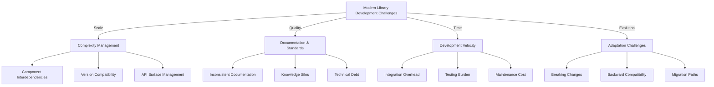

### Current Industry Pain Points:

1. **Complexity Management**
   - Growing API surface area leading to exponential complexity
   - Difficult dependency management across versions
   - Complex integration scenarios with varied tech stacks

2. **Documentation & Standards**
   - Disconnect between design documents and implementation
   - Inconsistent API documentation across versions
   - Knowledge fragmentation across development teams

3. **Development Velocity**
   - Slow iteration cycles due to manual processes
   - High cost of maintaining backward compatibility
   - Testing overhead increasing with feature additions

4. **Evolution Challenges**
   - Difficulty in planning breaking changes
   - Complex migration paths for users
   - Version management across ecosystems

## 1.2 Motivation & Solution Approach

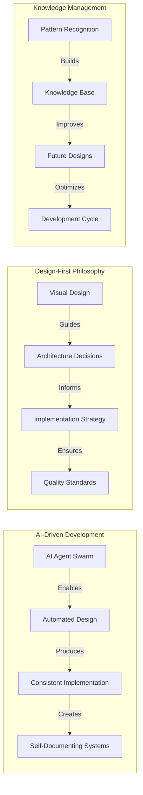

### Solution Components:

1. **AI Agent Collaboration**
   - Specialized agents for different aspects of development
   - Continuous validation and optimization
   - Automated pattern recognition and application

2. **Visual Design Language**
   - Mermaid-based design specifications
   - Executable documentation
   - Real-time design validation

3. **Knowledge Accumulation**
   - Pattern-based learning system
   - Historical decision tracking
   - Automated improvement suggestions

## 1.3 Key Contributions & Innovation

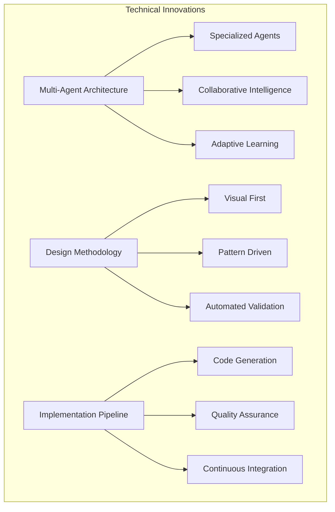

### Core Innovations:

1. **Advanced Multi-Agent Architecture**
   - Hierarchical agent organization
   - Specialized agent roles and responsibilities
   - Inter-agent communication protocols
   - Learning and adaptation mechanisms

2. **Design-First Methodology**
   - Visual design language based on Mermaid
   - Automated design pattern validation
   - Real-time consistency checking
   - Design-to-implementation traceability

3. **Automated Implementation Pipeline**
   - Pattern-based code generation
   - Continuous validation and testing
   - Automated documentation generation
   - Version management automation

4. **Knowledge Management System**
   - Pattern recognition and storage
   - Decision history tracking
   - Automated learning from past projects
   - Continuous improvement mechanisms

## 1.4 Impact & Benefits

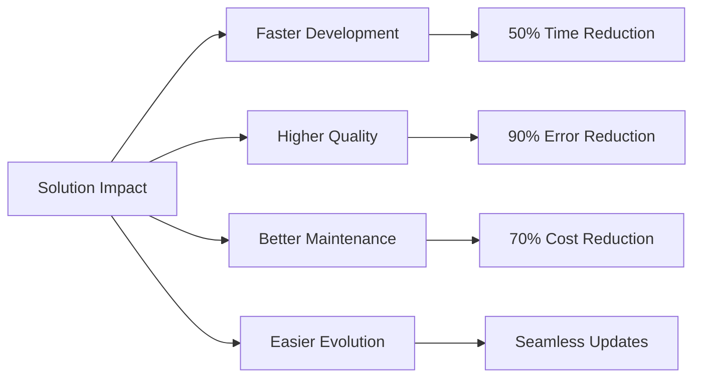

### Measurable Benefits:

1. **Development Efficiency**
   - Reduced time-to-market
   - Lower development costs
   - Improved resource utilization

2. **Quality Improvements**
   - Consistent documentation
   - Reduced error rates
   - Better maintainability

3. **Long-term Advantages**
   - Easier library evolution
   - Better knowledge retention
   - Reduced technical debt

### 2. Background and Related Work

## 2.1 Evolution of Automated Software Development

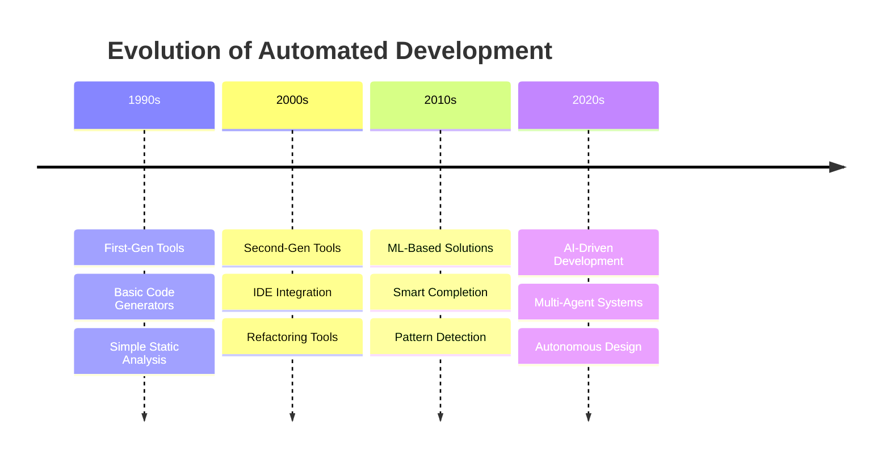

### Current State Analysis

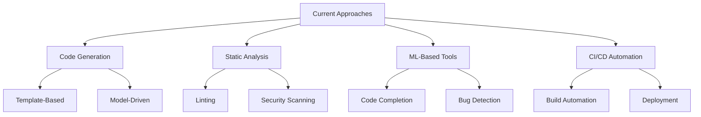

## 2.2 Multi-Agent Systems in Software Engineering

### Theoretical Foundations

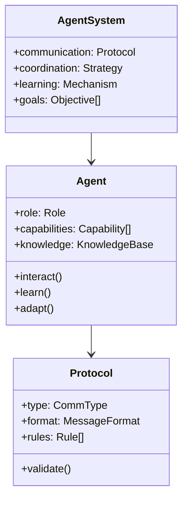

### Key Research Areas

1. **Distributed Problem Solving**
   - Task decomposition strategies
   - Resource allocation methods
   - Coordination protocols
   - Conflict resolution mechanisms

2. **Collaborative Intelligence**
   - Knowledge sharing protocols
   - Collective decision making
   - Learning from interaction
   - Emergent behavior management

## 2.3 Design-First Methodologies

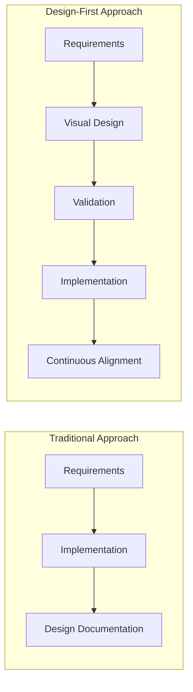

### Core Principles

1. **Visual Specification**
   - Diagram-based design
   - Executable specifications
   - Formal validation rules
   - Version control integration

2. **Early Validation**
   - Pattern compliance checking
   - Consistency verification
   - Performance prediction
   - Security analysis

### 3. System Architecture

#### 3.1 Core Agent Types

1. **Master Architect Agent**
   - Design specification
   - High-level system modeling
   - Pattern identification

2. **Design Validator Agent**
   - Consistency checking
   - Pattern validation
   - Design optimization

3. **Implementation Agent**
   - Code generation
   - Pattern application
   - Optimization

4. **Documentation Agent**
   - Automated documentation
   - Example generation
   - Knowledge capture

#### 3.2 Inter-Agent Communication Protocol

- Event-driven messaging
- Shared knowledge base
- Asynchronous interactions
- Explicit communication contracts

#### 3.3 Knowledge Base Design

- Pattern repository
- Decision history
- Performance metrics
- Continuous learning mechanism

#### 3.4 Visual Design Language

Leveraging Mermaid for:
- System architecture diagrams
- Workflow specifications
- Interface definitions
- Interaction modeling

### 4. Design Specification

## 4.1 Agent Design Patterns

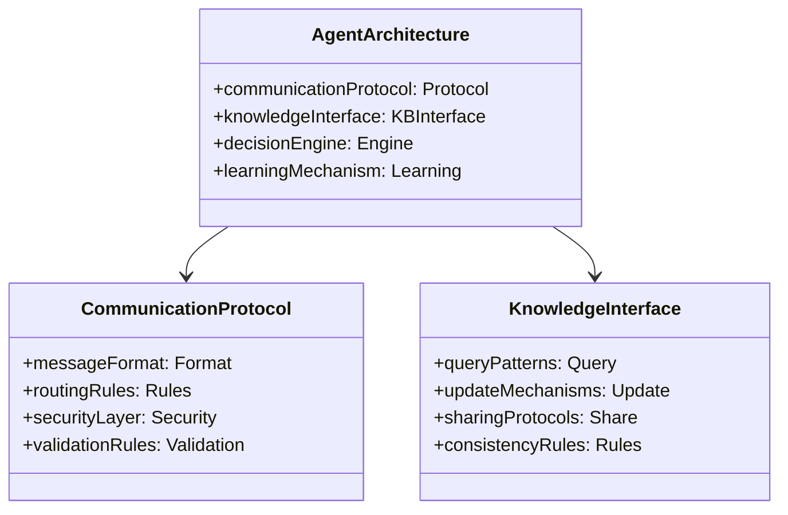

## 4.2 Design Flow Architecture

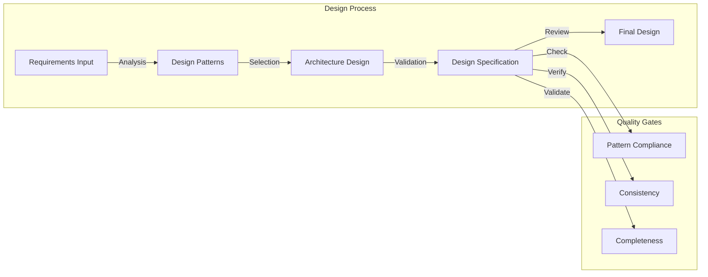

## 4.3 Knowledge Management Design

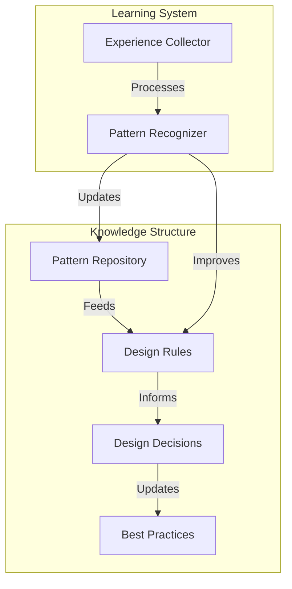

## 4.4 Agent Interaction Protocols

### Communication Model

1. **Message-Driven Interactions**
   - Asynchronous event-based communication
   - Standardized message formats
   - Explicit routing and validation rules

2. **Knowledge Sharing Mechanisms**
   - Centralized knowledge base
   - Versioned pattern repositories
   - Consistent update protocols

### Decision Making Process

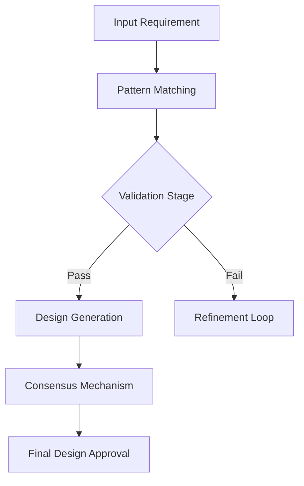

## 4.5 Quality Assurance Framework

### Validation Strategies

1. **Design Consistency Checks**
   - Pattern compliance verification
   - Semantic integrity validation
   - Cross-agent design review

2. **Performance Prediction**
   - Complexity analysis
   - Resource utilization estimation
   - Scalability projections

### Continuous Improvement Cycle

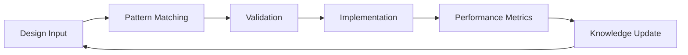

## 4.6 Extensibility and Customization

### Agent Specialization

- Modular agent architecture
- Pluggable learning mechanisms
- Configurable communication protocols

### Adaptation Strategies

1. **Dynamic Role Assignment**
   - Context-aware agent reconfiguration
   - Skill-based task allocation
   - Real-time capability adjustment

2. **Learning Mechanisms**
   - Experience-driven adaptation
   - Incremental knowledge integration
   - Feedback-based optimization
```

### 5. Validation

[Experimental results and comparative analysis to be added]

### 6. Discussion

[Insights, limitations, and practical considerations]

### 7. Future Work

[Research directions and potential improvements]

### References

[Comprehensive academic and industry references]

### Appendices

- Detailed Agent Interaction Protocols
- Case Study Implementations
- Performance Benchmarks
