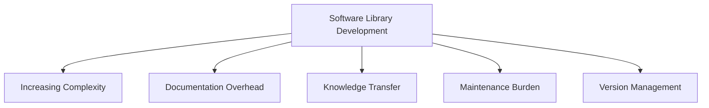
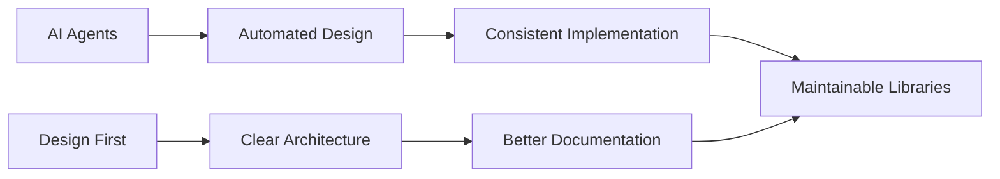

# Design-First Software Development Using AI Agent Swarms
## A New Paradigm for Library Development

### Abstract

The rapid evolution of software development demands innovative approaches that can address increasing complexity, reduce time-to-market, and maintain high-quality standards. This whitepaper introduces a novel methodology leveraging AI agent swarms and a design-first approach to transform library development.

### 1. Introduction

#### 1.1 Problem Statement

Current software library development faces critical challenges:

Specific challenges include:
- Growing complexity of software systems making library design difficult
- Inconsistent documentation and design practices
- High maintenance overhead due to evolving dependencies
- Difficulty in knowledge transfer between team members
- Version compatibility and API stability issues

#### 1.2 Motivation

Our solution addresses these challenges through innovative approaches:

Key motivational strategies:
- Intelligent, collaborative AI agents for design and implementation
- Visual design language for clear communication
- Automated validation and consistency checking
- Knowledge capture and transfer mechanisms

#### 1.3 Key Contributions

This research introduces a groundbreaking approach:
1. A novel multi-agent architecture specifically designed for library development
2. A design-first methodology using Mermaid as the primary design language
3. Automated design validation and implementation pipeline
4. Pattern-based knowledge accumulation system

### 2. Background

#### 2.1 Current State of Automated Software Development

Existing approaches to automated software development include:
- Code generation tools
- Static analysis systems
- Machine learning-based code completion
- Rule-based transformation systems

Our approach distinguishes itself by:
- Emphasizing design over implementation
- Enabling collaborative agent interactions
- Providing a holistic development ecosystem

#### 2.2 Related Work in Multi-Agent Systems

Key research areas:
- Distributed problem-solving
- Collaborative intelligence
- Agent communication protocols
- Knowledge representation

#### 2.3 Design-First Methodologies

Principles:
- Prioritize design over implementation
- Use visual, executable specifications
- Enable early validation
- Reduce implementation complexity

#### 2.4 Role of Visual Documentation

Visual documentation provides:
- Clear communication
- Abstraction of complex systems
- Easier knowledge transfer
- Standardized representation

### 3. System Architecture

#### 3.1 Core Agent Types

1. **Master Architect Agent**
   - Design specification
   - High-level system modeling
   - Pattern identification

2. **Design Validator Agent**
   - Consistency checking
   - Pattern validation
   - Design optimization

3. **Implementation Agent**
   - Code generation
   - Pattern application
   - Optimization

4. **Documentation Agent**
   - Automated documentation
   - Example generation
   - Knowledge capture

#### 3.2 Inter-Agent Communication Protocol

- Event-driven messaging
- Shared knowledge base
- Asynchronous interactions
- Explicit communication contracts

#### 3.3 Knowledge Base Design

- Pattern repository
- Decision history
- Performance metrics
- Continuous learning mechanism

#### 3.4 Visual Design Language

Leveraging Mermaid for:
- System architecture diagrams
- Workflow specifications
- Interface definitions
- Interaction modeling

### 4. Implementation Details

[Detailed technical implementation to be expanded]

### 5. Validation

[Experimental results and comparative analysis to be added]

### 6. Discussion

[Insights, limitations, and practical considerations]

### 7. Future Work

[Research directions and potential improvements]

### References

[Comprehensive academic and industry references]

### Appendices

- Detailed Agent Interaction Protocols
- Case Study Implementations
- Performance Benchmarks
